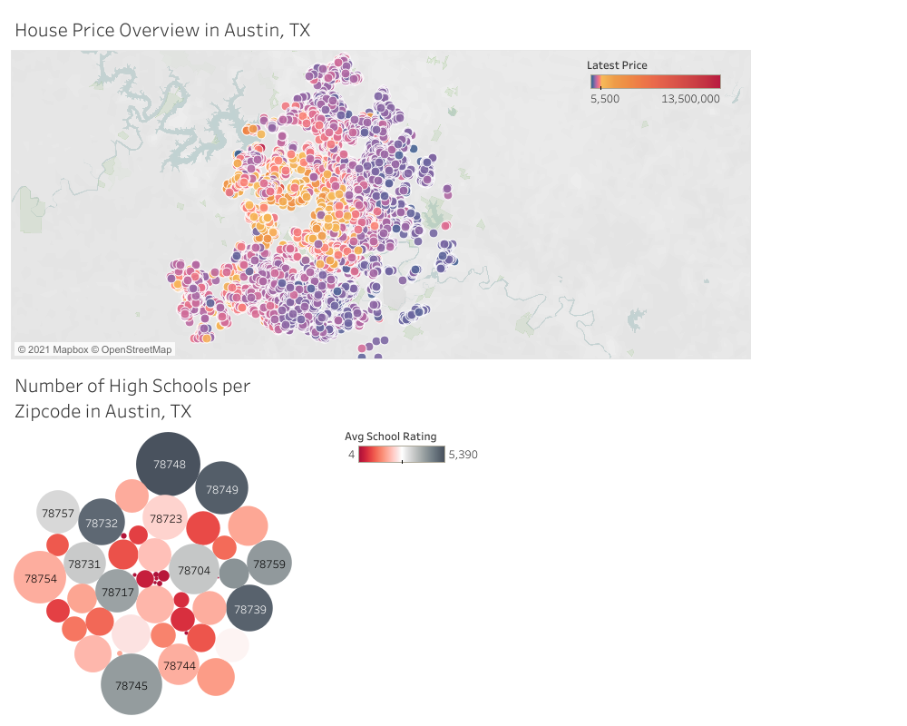

## Austin House Price Prediction - Minimum Viable Product

### Client: 

A construction company (specializing in residential housing) at Austin, Texas starts thier financial planning for the next year.
The manager of the financial department want to know the recent listing house price around the Austin area as an important factor for them estimating the construction budget.

### Question/Need:

Qestion: How can we predict the house price? 

Need: Past Listing House prices for houses in Austin, Texas and features related, i.e.,house location, bedroom numbers, garage spaces etc. 

### Impact：

When the contruction company get the listing house price, an estimation of the construction cost can be determined. Therefore, the financial department will
have a reliable source for planning construction supply budget that will not be wasteful or shortage next year. 
This data science solution for evaluating company budget will be more efficient and accurate then any other labor consuming work, which I will discuss in the "alternate Solution Path" Section. 

### Data Description:

I will use a data set from Kaggle about the listing house price in Austin, Texas:
https://www.kaggle.com/ericpierce/austinhousingprices?select=austinHousingData.csv

The data set contains ~10000 rows and ~47 columns.

Unit of Analysis (that will shown in MVP): Regional house price map and Number of High Schools per Zipcode.

Characteristics/Features: Living Area, Price source, property tax rate...

### Solution Path:

We want to predict house price in Austin, Texas --> We hypothesis that knowing the listing house price will help us link to the construction cost of the target property--> We will use the construction cost predicted for budget planning next year to prevent construction cost waste or shortage.

Alternate Solution Path: To predict the house price in Austin, Texas, if not using the data science method, we can manually collect construction material quantity, transpotation cost, current construction material price, etc. to calculate the potential construction budget for each potential project. However, this method can be complicated and with no reliable source to validate the calculation.

### Criteria for Success:

Predict the house price within +/-5% of the real listing 

### Assumptions and Risks:

Assumptions: House listing price has a stable link (relationship) to the construction cost.
Risks: If the House listing price is not representable to the construction cost, e.g., the recent new COVID variant change the relationship between the construction cost and house listing price, then our analysis will be not that valuable.
### Tools:

I will use Google sheets to perform EDA.
I will use Tableau to create Data visulization plots.

## MVP
In this MVP, I applied the cleaned up data to make two plots in Tableau:
1. Regional house price map;
2. Number of High Schools per Zipcode.
Based on the plots, I got the preliminary idea of the house price range and the distribution in Austin. Near downtown area, the house price would go high. I also want to verify if education will become an important influence factor in the house price. I plot the number of high schools as well as the ratings per zipcode. It is interesting that at several zipcode zone, the number of high school is high but the school rating is not as high. I will discover more in the school impact, not only High schools but also primary school and middle school.

I will study several trends between feature groups with the housing price. In the end, I will perform a regression analysis to also validate whether these individual feature analysis supports the house price prediction.

