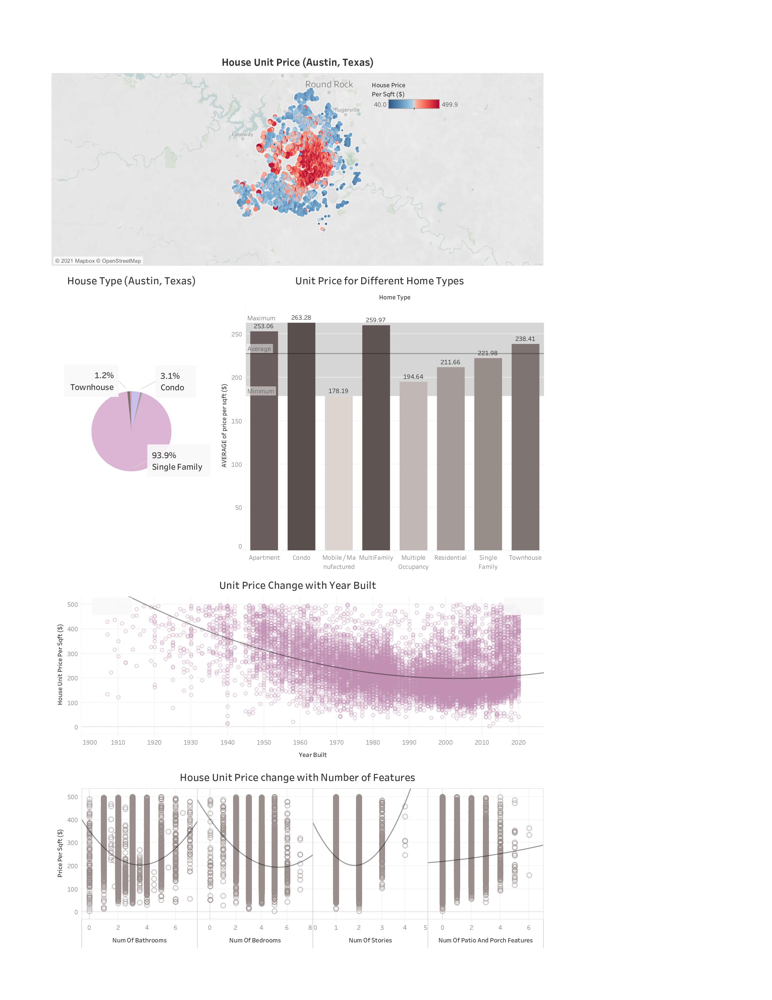

## BID ON THE RIGHT ONE! - SOLVE PROFIT PROBLEM FOR A CONSTRUCTION COMPANY

### Abstract

A construction company (size small, all construction project qualified) at Austin, Texas starts thier business planning for the next year. They are facing a problem that they were bidding on wrong projects the past year, which are not as profitable as the ones selected by other similar construction companies. The house price data in local Austin, Texas were collected and explored to gain insights on solving the construction company's problem. After the data analysis, some features or patterns that relates to popular profitable projects were generated. Based on these results recommendation solution path was provided to the construction company's excutive officers. The data analysis applied Google sheets and Tableau as the primary data analysis and visualization tools, repectively. 

### Design

Austin Housing data were analysed with Google sheets. There are several results summarized: 1. The most popular/valuable house type is SINGLE FAMILY. 2. Average single family house unit price is $ 222. 3. The most popular/valuable house location is DOWNTOWN AUSTIN. 4. The number of house feature has the negative impact to the house price.
#### Impact Hypothesis:

Focus more on projects that is SINGLE FAMILY HOUSE with LESSHOUSE FEATURES and locates near Downtown Austin in order to increase company profit.

#### Criteria for Success:

Increase the number of “Satisfied” (profitable) Project by 20 %

#### Solution Path:

BASED ON THE “PROFITABLE HOUSE CRITERION” TO SEARCH FOR MULTIPLE PROJECTS --> PREDICT CONSTRUCTION PROFIT USE A REGRESSION TOOL TO DECIDE ON THE BEST CHOICE AND THE CONSTRUCTION PRICE ESTIMATION --> PREPARE FOR BIDDING, WIN THE PROJECT!

### Assumptions and Risks:

Assumptions: .
Risks: If the House listing price is not representable to the construction cost, e.g., the recent new COVID variant change the relationship between the construction cost and house listing price, then our analysis will be not that valuable.

### Data

I will use a data set from Kaggle about the listing house price in Austin, Texas:
https://www.kaggle.com/ericpierce/austinhousingprices?select=austinHousingData.csv

The data set contains ~10000 rows and ~47 columns (house features).

### Algorithms
Python Pandas is used for preliminary data cleaning.
Google sheets does the primary data analysis. Function used including:
pivot tables, charts, Vlookup
Tableau is the primary tool for data visulization. Function used including:
Geographicl mapa and relationships, bar-charts, pie chart, polynomial trendline.
### Tools

Google sheets is used to perform EDA.
Tableau is used to create Data visulization plots.

## COMMUNICATION
Please see the Tableau plots for data visulization results.

